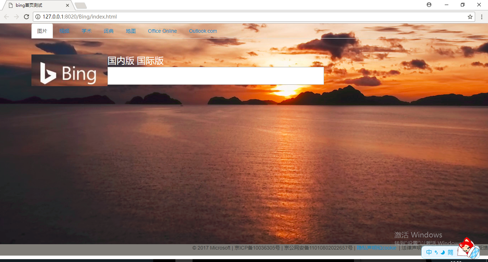
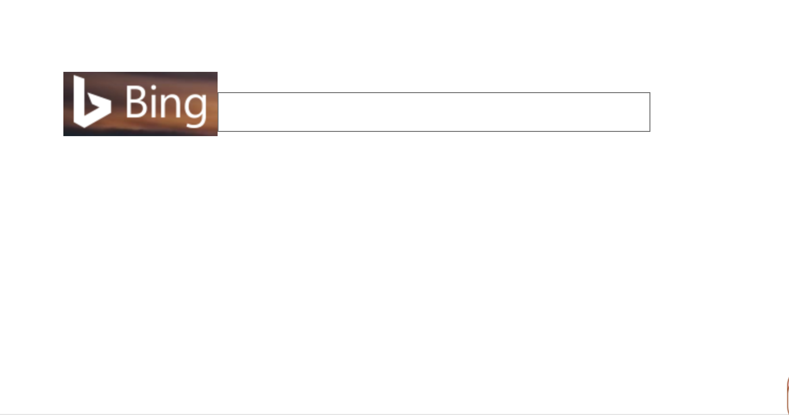
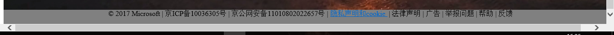

# WEB组培训记录

- 2017-11-23 bing首页  

培训内容:  
html + 表单 + github代码托管  

预习知识：  
1. html基本元素 http://w3school.com.cn/html/index.asp  
2. html表单的使用  
3. 了解github（比如先注册一个github账号） https://github.com/

培训时间：  14:30-17:30

 - 2017-11-26 协作完成仓库合并
 
培训内容：  
1. 完成bing首页制作并推到github保存  
2. 三人团队协作完成千里总仓库的合并  
培训成果：  
  
培训时间： 15:00-17:00

培训内容：康洁    
1. 用html制作bing的搜索框   
2. 用CSS确定各项内容的位置  
培训结果：  
  
培训内容：陈伟杰  
### 进行bing网页的脚本制作  

  

